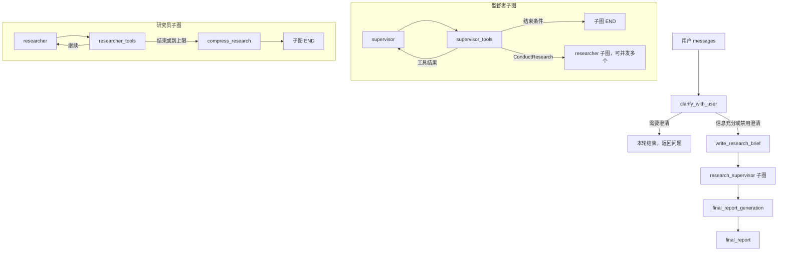

# Open Deep Research：从读懂源码到独立实现

> 本文根据当前仓库源码编写，核对日期：2026-09-19，基准提交：`b2f27fd`。重点是当前 `src/open_deep_research/` 实现；历史实现、鉴权和评估在后面的独立章节解释。文中的“当前实现”指实际执行语义，“建议实现”指教学中的改进方案，两者不会混用。
>
> 阅读目标：能够自己写出状态定义、模型适配层、工具调度循环、并发研究单元、证据整理和报告生成，并能解释每条消息为什么产生、被谁读取、何时终止。只记住流程图不算完成。

## 目录

1. [项目到底实现了什么](#c01)
2. [读代码需要的 Python 与 LangGraph 基础](#c02)
3. [数据结构：先确定数据怎么流动](#c03)
4. [配置与模型：一次调用如何真正构造出来](#c04)
5. [主图前半段：澄清与研究简报](#c05)
6. [监督者：把模型的工具请求变成研究任务](#c06)
7. [研究员：实现真正的工具调用循环](#c07)
8. [搜索：从查询到有来源的材料](#c08)
9. [压缩与最终报告：两次不同的合成](#c09)
10. [提示词：它们分别约束什么](#c10)
11. [把节点组装成三张图](#c11)
12. [跟踪一次完整运行](#c12)
13. [MCP 与身份认证逐函数解读](#c13)
14. [评估代码与历史实现](#c14)
15. [从零写出可运行的离线教学版](#c15)
16. [把教学版换成真实模型与工具](#c16)
17. [源码中的边界、缺陷与改进](#c17)
18. [独立复现路线与验收题](#c18)
19. [源码符号索引](#c19)

<a id="c01"></a>
## 1. 项目到底实现了什么

假设用户说：“比较 SQLite 与 PostgreSQL 对小型应用的适用性，分析部署、并发写入和迁移成本。”程序最终需要生成一份带来源的 Markdown 报告。模型不会自动完成所有工程工作：Python 负责执行搜索、保存历史、启动多个研究任务、限制循环，以及处理错误。

项目把任务拆成三种职责：

- **监督者**拿着完整研究简报决定“还缺哪些材料”，通过 `ConductResearch` 提出子任务。
- **研究员**只收到自己的子任务，通过搜索等工具收集材料，再整理为 `compressed_research`。
- **报告模型**读取各个研究结果和原始用户需求，撰写最终报告。

它们可以使用同一个模型型号。“多个智能体”主要意味着不同的消息历史、提示词和控制循环，不意味着必须启动多个进程、训练多个模型或使用不同厂商。

### 1.1 文件分别负责什么

| 文件 | 你应该从这里学会什么 |
| --- | --- |
| `src/open_deep_research/state.py` | 用 schema 定义模型输出和状态，用 reducer 定义状态如何合并 |
| `src/open_deep_research/configuration.py` | 把环境变量和调用参数变成经过校验的配置对象 |
| `src/open_deep_research/deep_researcher.py` | 节点函数、模型调用、工具路由、并发和图装配 |
| `src/open_deep_research/utils.py` | 搜索、网页摘要、工具注册、MCP、密钥选择和错误识别 |
| `src/open_deep_research/prompts.py` | 各次模型调用的工作合同 |
| `src/security/auth.py` | 请求身份认证和按 owner 隔离资源 |
| `tests/` | 用外部评估数据和模型评审衡量报告质量 |
| `src/legacy/` | 按章节规划和另一种多智能体实现，可作为架构对照 |
| `langgraph.json` | 指定平台应导入的图对象与鉴权入口 |
| `pyproject.toml` | 包路径、依赖、Python 要求与代码检查配置 |

当前目录 `open_deep_research.egg-info/` 是安装生成的包元信息目录，不是主要源码，也不适合保存手写教程。因此本文放在仓库根目录下的 `docs/`。

### 1.2 一眼看清“数据经过了什么变换”

```text
messages：用户对话
  ↓ 结构化输出 ResearchQuestion
research_brief：完整研究需求
  ↓ 监督者生成 ConductResearch 参数
research_topic：某个独立子问题
  ↓ 研究员生成查询并接收 ToolMessage
researcher_messages：研究过程的消息历史
  ↓ 压缩模型
compressed_research：一份带来源的整理材料
  ↓ 包装为监督者的 ToolMessage，再提取
notes：多份整理材料及其他监督者工具结果
  ↓ 报告模型
final_report：最终报告文本
```

另一条支路是 `raw_notes`，用于保留研究过程中的 AI/工具文本，供依据性评估使用。它不是 Tavily 所有原始网页的无损归档。

<a id="c02"></a>
## 2. 读代码需要的 Python 与 LangGraph 基础

### 2.1 `async def`、`await` 和 `asyncio.gather`

```python
results = await asyncio.gather(
    research_one("SQLite"),
    research_one("PostgreSQL"),
)
```

调用异步函数得到协程对象；`gather` 调度它们并发执行；`await` 等待结果。这适合模型和搜索这类等待 I/O 的任务。结果列表保持**输入任务顺序**，并非谁先完成谁排在前面，所以后面可以安全地 `zip(results, calls)`。

默认 `gather` 遇到异常会向调用方传播异常；不能把它理解成“自动保留所有成功结果”或“自动取消其他全部任务”。需要部分成功时，应显式使用 `return_exceptions=True` 并逐项处理，或者在各任务内部捕获异常。

### 2.2 节点返回的是增量，不是整份新状态

```python
return {"notes": ["新材料"]}
```

这表示只更新 `notes`，其他字段由框架保留。新值是覆盖还是追加，由字段的 reducer 决定。

```python
return Command(
    goto="researcher_tools",
    update={"researcher_messages": [response]},
)
```

`Command` 同时表示两件事：先合并 `update`，然后把执行交给 `goto` 指定的节点。`goto=END` 只结束当前所在图；若这是主图中的子图，父图仍能继续执行后续节点。

### 2.3 `TypedDict` 与 Pydantic 不是同一种用途

`TypedDict` 描述字典应有哪些键，主要服务于类型检查和框架读取状态 schema；它不是自动校验任意输入的 Pydantic 实例。给 `TypedDict` 类字段写 `= 0`，不能据此假定所有运行时字典一定已有这个键，所以源码反复使用 `state.get("research_iterations", 0)`。

`BaseModel` 可以解析、校验数据。`ClarifyWithUser` 等对象让模型返回具名字段，程序随后可以访问 `response.need_clarification`。但 `Field(description="至少一段话")` 只是描述，并没有真正执行“至少一段话”的校验；需要硬约束必须加校验器或长度限制。

### 2.4 四种消息及工具调用关联

| 类型 | 含义 | 本项目中的例子 |
| --- | --- | --- |
| `SystemMessage` | 角色、任务规则 | 研究员提示词 |
| `HumanMessage` | 用户输入或本轮任务 | 子研究主题、要求整理材料 |
| `AIMessage` | 模型输出，可包含工具调用 | 模型请求 `tavily_search` |
| `ToolMessage` | 程序执行工具后的结果 | 搜索结果和来源 URL |

一次工具交互的最小结构：

```python
from langchain_core.messages import AIMessage, ToolMessage

request = AIMessage(content="", tool_calls=[{
    "name": "tavily_search",
    "args": {"queries": ["SQLite concurrent writes documentation"]},
    "id": "search_001",
    "type": "tool_call",
}])
observation = ToolMessage(
    content="搜索材料…… URL: https://example.invalid/sqlite",
    name="tavily_search",
    tool_call_id="search_001",
)
```

`id` 与 `tool_call_id` 必须对应。如果一条 AI 消息提出多个工具调用，继续交给模型前通常必须为每个调用补上结果，包括失败和被拒绝的调用。`.bind_tools()` 只是让模型知道可以请求什么工具，**不会替 Python 执行工具**。

<a id="c03"></a>
## 3. 数据结构：先确定数据怎么流动

### 3.1 五个结构化输出类型

| 类型 | 字段 | 谁生成，谁使用 |
| --- | --- | --- |
| `ConductResearch` | `research_topic: str` | 监督者生成；调度器据此启动研究员 |
| `ResearchComplete` | 无字段 | 模型发出结束信号；程序检查工具名 |
| `Summary` | `summary`, `key_excerpts` | 网页摘要模型生成；搜索工具格式化 |
| `ClarifyWithUser` | `need_clarification`, `question`, `verification` | 澄清模型生成；主图决定结束或继续 |
| `ResearchQuestion` | `research_brief` | 简报模型生成；监督者与报告模型读取 |

`ConductResearch` 是参数协议，不是包含研究算法的函数。真正的执行逻辑位于 `supervisor_tools`。`ResearchComplete` 没有参数，因为程序只需要这个动作发生，不需要额外内容。

### 3.2 三种状态合并方式

普通字段如 `research_brief`、`final_report` 采用新值覆盖旧值。`researcher_messages` 用 `operator.add`，对列表就是拼接。

项目自定义 `override_reducer` 的关键逻辑如下：

```python
import operator

def override_reducer(current_value, new_value):
    if isinstance(new_value, dict) and new_value.get("type") == "override":
        return new_value.get("value", new_value)
    return operator.add(current_value, new_value)
```

实际算一次：

```python
assert override_reducer(["A"], ["B"]) == ["A", "B"]
assert override_reducer(["A"], []) == ["A"]
assert override_reducer(["A"], {"type": "override", "value": []}) == []
```

第二行说明为什么报告节点不能用 `{"notes": []}` 清空笔记：追加空列表并不删除旧材料。第三行的字典是**更新指令**，归约后状态中存放的仍然是列表。

`MessagesState.messages` 使用 LangGraph 的消息合并逻辑，能够根据消息 ID 更新已有消息，并将受支持的消息表示转换为消息对象。它不等同于普通 `operator.add`，也不能把自定义 override 字典随意应用到这个字段。

### 3.3 主状态 `AgentState`

| 字段 | 写入者 | 读取者 | 合并语义 |
| --- | --- | --- | --- |
| `messages` | 调用者、澄清节点、报告节点 | 澄清、简报、报告 | 消息归约 |
| `research_brief` | 简报节点、监督者退出 | 监督者、报告 | 覆盖 |
| `supervisor_messages` | 简报节点、监督者子图 | 监督者 | 默认追加，可显式覆盖 |
| `notes` | 监督者退出 | 报告节点 | 默认追加，可清空 |
| `raw_notes` | 子研究结果经监督者汇总 | 依据性评估 | 默认追加，可覆盖 |
| `final_report` | 报告节点 | 调用者、评估器 | 覆盖 |

`AgentInputState` 只暴露 `messages`。调用者无需构造全部中间字段。

### 3.4 子图状态的隔离

`SupervisorState` 包含监督者消息、简报、笔记和计数。`ResearcherState` 包含自己的消息、主题、计数和压缩结果。研究员不会自动看见主图的 `messages` 或其他研究员的材料。

监督者启动子研究时明确构造输入：

```python
{
    "researcher_messages": [HumanMessage(content=topic)],
    "research_topic": topic,
}
```

因此，主题必须自包含。例如“研究第二点”没有可解释上下文；“研究 PostgreSQL 对小型应用的部署维护成本，优先官方文档，并保留来源 URL”才足够。

`ResearcherOutputState` 只把 `compressed_research` 和 `raw_notes` 暴露给调用者。内部的工具循环历史不必整体回传给监督者。这里是接口边界，不是隐私隔离系统。

<a id="c04"></a>
## 4. 配置与模型：一次调用如何真正构造出来

### 4.1 配置优先级必须以代码为准

`Configuration.from_runnable_config` 对每个字段执行：

```python
os.environ.get(field_name.upper(), configurable.get(field_name))
```

然后去掉 `None`，交给 Pydantic 构造配置对象。因此优先级是：

```text
大写环境变量 > config["configurable"] 中的字段 > Pydantic 默认值
```

如果 `RESEARCH_MODEL` 已存在，即使你在调用参数里换了 `research_model`，仍会使用环境变量。环境变量为空字符串也算存在，不会自动回退。布尔、整数等字符串由 Pydantic 尝试转换；转换失败会报错。

`.env` 不会因为文件存在而自动加载。平台通过 `langgraph.json` 的 `env` 加载；直接写 Python 入口则需要 `load_dotenv` 或由外层准备环境。

### 4.2 当前源码默认值

| 字段 | 默认值 | 实际意义 |
| --- | --- | --- |
| `allow_clarification` | `True` | 是否先检查研究需求是否清楚 |
| `max_structured_output_retries` | `3` | 部分模型 Runnable 的最大尝试次数 |
| `max_concurrent_research_units` | `2` | 每轮允许执行的 `ConductResearch` 数量 |
| `max_researcher_iterations` | `3` | 监督者工具执行轮数上限，详见第 6 节 |
| `max_react_tool_calls` | `5` | 研究员模型轮数上限，不是搜索请求总数 |
| `search_api` | `tavily` | 默认使用独立搜索工具 |
| 四个模型字段 | `openai:deepseek-flash` | 当前本地化版本的默认配置字符串 |
| `summarization_model_max_tokens` | `8192` | 单网页摘要最大输出预算 |
| `research_model_max_tokens` | `10000` | 澄清、简报、监督者、研究员的输出预算 |
| `compression_model_max_tokens` | `8192` | 单个研究材料整理的输出预算 |
| `final_report_model_max_tokens` | `10000` | 最终报告输出预算 |
| `max_content_length` | `50000` | 单网页摘要前的字符截断长度 |
| `mcp_config`, `mcp_prompt` | `None` | 外部工具配置与附加使用说明 |

README 中仍有上游默认模型说明，与本地源码默认值不同。`deepseek-flash` 是否为某个服务端可用模型，要由实际供应商支持决定，不能从字符串推断。`openai:` 在这里选择兼容接口的适配器，不表示模型必然由 OpenAI 提供。

UI metadata 中的 `min`/`max` 是界面描述，不是 Pydantic 的 `ge`/`le` 校验。自己重写配置时应为并发和轮数添加正数约束，否则零和负值会造成奇怪的列表切片与退出行为。

### 4.3 可配置模型对象怎样使用

模块顶部：

```python
configurable_model = init_chat_model(
    configurable_fields=("model", "max_tokens", "api_key", "extra_body"),
)
```

它提供可在调用时选模型的 Runnable。各节点随后传入：

```python
model_config = {
    "model": configurable.research_model,
    "max_tokens": configurable.research_model_max_tokens,
    "api_key": get_api_key_for_model(configurable.research_model, config),
    "extra_body": get_model_extra_body(configurable.research_model),
    "tags": ["langsmith:nostream"],
}
```

`tags` 是运行标签，不是提示词，也不是模型参数 schema 的一部分。`max_tokens` 限制输出，不能直接解决输入历史过长的问题。

结构化调用链：

```python
model = (
    configurable_model
    .with_structured_output(ResearchQuestion, method="function_calling")
    .with_retry(stop_after_attempt=3)
    .with_config(model_config)
)
response = await model.ainvoke([HumanMessage(content=prompt)])
brief = response.research_brief
```

每层分别负责输出解析、失败重试、运行配置。`stop_after_attempt=3` 是最多尝试三次，包含第一次。这里的结构化工具调用用于取回一个对象，不会经过 `researcher_tools` 的业务工具执行循环。

工具选择调用链改为 `.bind_tools(tools)`，返回的则是 `AIMessage`，需要 Python 检查 `.tool_calls`。

### 4.4 密钥与兼容接口的两个独立维度

`get_api_key_for_model` 默认读取环境变量。设置 `GET_API_KEYS_FROM_CONFIG=true` 时，改从 `config["configurable"]["apiKeys"]` 读取。两种模式不会自动混合回退。

本函数显式支持 `openai:`、`anthropic:` 和以 `google` 开头的模型字符串。其他提供商返回 `None`，是否能工作依赖其 SDK 自己的认证逻辑，不能理解成“任意模型都由这个函数完整支持”。Tavily 使用独立的 `get_tavily_api_key`。

`get_model_extra_body` 发现模型名包含 `deepseek`，就返回 `{"thinking": {"type": "disabled"}}`，其余返回 `None`。这是本仓库的兼容性选择；目标接口是否接受这些字段需由用户验证。

<a id="c05"></a>
## 5. 主图前半段：澄清与研究简报

### 5.1 `clarify_with_user` 逐步拆解

输入是当前 `state["messages"]` 和运行配置，输出是一个 `Command`。

1. 构造 `Configuration`。关闭澄清时直接 `goto="write_research_brief"`，不调用模型。
2. 使用研究模型和 `ClarifyWithUser` schema 构造结构化 Runnable。
3. `get_buffer_string(messages)` 将多条消息转成带角色标记的文本，填入澄清提示词；`get_today_str()` 提供日期上下文。
4. 调用模型，得到包含三个字段的对象。
5. 若 `need_clarification=True`，把 `question` 包装成 AI 消息，并结束**本次主图运行**。
6. 否则把 `verification` 放进消息历史，进入简报节点。

这里没有调用 LangGraph 的 `interrupt()`。用户回答之后，需要调用者再次输入新消息；如使用持久化线程，应复用该线程，否则应由调用者显式携带完整对话。仅仅返回 `END` 不会让进程自动等待并接收用户回复。

### 5.2 `write_research_brief` 为什么不能只是复制用户输入

用户需求可能分散在多轮消息里：第一轮提出主题，第二轮限定地区，第三轮要求特定时间范围。研究员只看子任务，所以要先把全部条件写进一份独立简报。

该函数将消息历史格式化，使用 `ResearchQuestion` 得到 `research_brief`，再构造监督者系统提示词。返回的状态更新同时包含：

```python
{
    "research_brief": response.research_brief,
    "supervisor_messages": {
        "type": "override",
        "value": [
            SystemMessage(content=supervisor_system_prompt),
            HumanMessage(content=response.research_brief),
        ],
    },
}
```

覆盖监督者历史是有意的：新的研究应以新简报开始，不应把上一轮的工具调用当作当前研究的起点。注意它没有顺带清空所有其他字段；多次运行的状态生命周期必须额外考虑。

<a id="c06"></a>
## 6. 监督者：把模型的工具请求变成研究任务

### 6.1 `supervisor` 本身不执行研究

函数读取 `supervisor_messages`，绑定三种工具：`ConductResearch`、`ResearchComplete`、`think_tool`，调用模型，再返回：

```python
Command(
    goto="supervisor_tools",
    update={
        "supervisor_messages": [response],
        "research_iterations": state.get("research_iterations", 0) + 1,
    },
)
```

计数增加的是“监督者模型调用轮数”。一轮只调用 `think_tool` 也会增加计数；一轮提出两个研究任务仍只加一。

### 6.2 `supervisor_tools` 的退出检查发生在执行工具之前

依次计算：

```python
exceeded = research_iterations > max_researcher_iterations
no_calls = not latest.tool_calls
complete = any(call["name"] == "ResearchComplete" for call in latest.tool_calls)
```

任意一个为真，立即提取当前监督者历史中的所有工具消息写入 `notes`，然后结束子图。

当上限为 `3` 且模型一直请求工具时：

| 模型轮次 | 累积计数 | `> 3` | 本轮工具执行吗 |
| --- | --- | --- | --- |
| 1 | 1 | 否 | 执行 |
| 2 | 2 | 否 | 执行 |
| 3 | 3 | 否 | 执行 |
| 4 | 4 | 是 | 不执行，结束 |

所以最多能出现四次监督者模型调用，但只有前三轮工具可执行。这是源码的边界行为，不应写成“模型最多调用三次”。如果一轮同时包含完成信号和研究请求，整轮研究请求都会被跳过。

### 6.3 思考工具为什么只生成一个结果消息

监督者侧直接读取 `reflection`，创建 `ToolMessage(content="反思已记录：...")`，没有再次调用 `think_tool` 函数。该工具是规划记录的载体，不执行搜索，不产生新外部证据，也没有独立推理算法。

提示词要求不要把 `think_tool` 与其他工具并行请求，但 Python 仍能处理一轮同时存在的两类请求。提示词约束不是硬性的调度规则。

### 6.4 研究任务的并发是怎样写出来的

```python
allowed = conduct_calls[:max_concurrent_research_units]
overflow = conduct_calls[max_concurrent_research_units:]

research_tasks = [
    researcher_subgraph.ainvoke({
        "researcher_messages": [HumanMessage(content=call["args"]["research_topic"])],
        "research_topic": call["args"]["research_topic"],
    }, config)
    for call in allowed
]
results = await asyncio.gather(*research_tasks)
```

这段代码有四个明确含义：

- 每个 `ainvoke` 接收独立输入，因此每个研究员有自己的消息历史。
- `config` 继续向下传，使模型和搜索设置一致。
- 限制方式是截取本轮请求列表，不是排队调度，也不是全局信号量。
- 超出上限的任务不会稍后自动执行，而是收到一条“未执行，请减少并发数”的工具结果。

随后用 `zip(results, allowed)` 把每份 `compressed_research` 对应回原始 tool call ID。研究员各自的 `raw_notes` 先拼成字符串，再作为列表元素追加到监督者状态。

### 6.5 为什么最终 `notes` 不一定全是研究报告

`get_notes_from_tool_calls` 的实现只按消息类型筛选：

```python
return [m.content for m in filter_messages(messages, include_types="tool")]
```

没有限制 `name == "ConductResearch"`。因此 `think_tool` 的反思记录、超额任务错误也会进入最终写作输入。自己实现时可以按工具名或结构化结果类型筛选，但那属于改进，不能声称当前代码已经这样做了。

### 6.6 异常路径必须读到条件表达式

源码中有：

```python
try:
    ...  # 研究任务与结果处理
except Exception as e:
    if is_token_limit_exceeded(e, configurable.research_model) or True:
        return Command(goto=END, update={...})
```

`or True` 使条件恒真。研究任务、结果处理等 `try` 范围内的任意异常都会结束监督者研究阶段，而不是只有 token 超限。父图随后仍可能基于已有少量笔记生成报告。这个机制使“成功返回了报告”不等于“所有研究任务成功”。

<a id="c07"></a>
## 7. 研究员：实现真正的工具调用循环

### 7.1 `researcher`：准备工具、调用模型、保存请求

函数先调用 `get_all_tools(config)`，随后绑定工具，用下面的消息列表调用模型：

```python
messages = [SystemMessage(content=researcher_prompt)] + researcher_messages
```

系统提示词每次调用都临时加在最前面，不反复追加到状态历史，因此不会出现每轮多一份系统提示词。`researcher_prompt` 中注入当前日期以及可选的 `mcp_prompt`。

得到 AI 响应后，追加到 `researcher_messages`，把 `tool_call_iterations` 加一，跳到 `researcher_tools`。研究员和监督者使用同一个 `research_model` 配置字段，但上下文、工具列表和状态都不同。

源码检查 `len(tools) == 0` 时会报“没有研究工具”。然而 `get_all_tools` 总是先放入 `ResearchComplete` 和 `think_tool`，所以正常返回时即使没搜索、没 MCP，也至少有两个工具。此检查不能证明研究员真的能获取外部证据。

### 7.2 `researcher_tools`：先检查是否有事可做

```python
has_tool_calls = bool(latest.tool_calls)
has_native_search = (
    openai_websearch_called(latest)
    or anthropic_websearch_called(latest)
)
if not has_tool_calls and not has_native_search:
    return Command(goto="compress_research")
```

普通工具由 Python 执行；原生网页搜索由模型供应商在模型请求中执行，结果和调用痕迹放在响应的特定结构中。不能因为 `.tool_calls` 为空就断言模型没有搜索过。

当前检测方法：

- OpenAI：检查 `response.additional_kwargs["tool_outputs"]` 是否包含 `type="web_search_call"`。
- Anthropic：检查 `response.response_metadata["usage"]["server_tool_use"]["web_search_requests"] > 0`。

这些是与 SDK 响应形状相关的兼容代码，不是永远稳定的协议保证。切换 SDK 或原生搜索接口后，应验证实际消息形状。

### 7.3 工具名到 Python 对象的映射

重新加载工具后，构造：

```python
tools_by_name = {
    t.name if hasattr(t, "name") else t.get("name", "web_search"): t
    for t in tools
}
```

普通 LangChain 工具有 `.name` 和 `.ainvoke`；原生搜索配置是字典。字典用于模型绑定，并不是具有 `.ainvoke` 的本地函数。正常情况下原生搜索不应作为普通 Python 工具调用再次执行。

每个普通调用转换成协程：

```python
execute_tool_safely(
    tools_by_name[call["name"]],
    call["args"],
    config,
)
```

`execute_tool_safely` 捕获工具执行异常，返回错误字符串，让模型下一轮能看到失败并调整策略。然而 `tools_by_name[...]` 的查找发生在进入包装函数之前，未知工具名引发的 `KeyError` 不会被这个包装器捕获。

### 7.4 工具结果必须和请求配对

所有工具并发执行完成后，对每项结果创建：

```python
ToolMessage(
    content=observation,
    name=call["name"],
    tool_call_id=call["id"],
)
```

随后才检查：

```python
exceeded = tool_call_iterations >= max_react_tool_calls
complete = any(c["name"] == "ResearchComplete" for c in latest.tool_calls)
```

达到上限时，本轮工具已经执行完，其结果仍追加进历史，然后进入压缩。因此研究员上限为 `5` 时，最多五轮模型输出及其对应工具执行；第六轮不会开始。

每轮可能有多个搜索工具调用，每个搜索工具参数又可能含多个查询。因此：

```text
模型轮数 ≠ 工具调用个数 ≠ 搜索查询数 ≠ 网页摘要模型调用数
```

此外，研究员侧完成信号是在执行工具之后检查。`get_all_tools` 将 `ResearchComplete` 转成可调用工具；与它同一轮的其他工具也会被执行。这与监督者侧提前退出的行为不同。

### 7.5 用普通 Python 表达同一个循环

以下是解释性伪代码，省略原生搜索和消息对象细节：

```text
历史 = [研究主题]
重复直到达到轮数上限：
    回答 = await 模型(系统提示词 + 历史, 工具定义)
    历史追加回答
    如果回答既没有普通工具请求，也没有原生搜索：
        结束循环
    结果列表 = await 并发执行普通工具请求
    历史追加结果列表
    如果本轮有完成信号：
        结束循环
整理材料 = await 压缩模型(历史)
```

LangGraph 把循环拆成两个节点的价值是：状态和转移显式可见，可接入持久化、可观察执行步骤，并复用研究子图。核心决策逻辑仍然是普通 Python。

<a id="c08"></a>
## 8. 搜索：从查询到有来源的材料

### 8.1 `get_search_tool` 的四个分支

| 配置值 | 返回对象 | 谁执行搜索 |
| --- | --- | --- |
| `tavily` | `tavily_search` 工具 | Python 调用 Tavily |
| `openai` | `{"type": "web_search_preview"}` | 兼容的模型供应商接口 |
| `anthropic` | 包含 `web_search_20250305`、`name` 和 `max_uses=5` 的字典 | Anthropic 原生搜索 |
| `none` | 空列表 | 不提供搜索 |

当前主实现没有在 `SearchAPI` 枚举中直接接入 Exa、DuckDuckGo、ArXiv、PubMed。依赖或历史目录中有这些名字，不等于当前主图能直接通过相同配置选用。

Tavily 工具设置的 metadata `name="web_search"` 是元数据，不会把工具真正的 `.name` 从 `tavily_search` 改成 `web_search`。

### 8.2 `@tool` 如何形成一个可被模型请求的函数

原函数签名：

```python
@tool(description=TAVILY_SEARCH_DESCRIPTION)
async def tavily_search(
    queries: List[str],
    max_results: Annotated[int, InjectedToolArg] = 5,
    topic: Annotated[Literal["general", "news", "finance"], InjectedToolArg] = "general",
    config: RunnableConfig = None,
) -> str:
    ...
```

`@tool` 根据名称、说明和类型构造工具 schema，并提供 `.ainvoke`。`queries` 由模型生成。`InjectedToolArg` 表示参数不应暴露给模型生成，当前执行路径未额外设置它们时使用函数默认值。`RunnableConfig` 由工具运行框架传递，不让模型填写密钥配置。

这体现一个重要边界：**模型决定研究查询，程序控制执行参数和凭据**。

### 8.3 `tavily_search_async` 负责实际请求

1. `get_tavily_api_key(config)` 取得密钥。
2. 构造 `AsyncTavilyClient`。
3. 对查询列表的每一项调用 `client.search`，附带 `max_results`、`include_raw_content`、`topic`。
4. `asyncio.gather` 并发等待，返回多个搜索响应。

这里没有全局限流器，也没有此函数自己的重试。一个批次的查询失败可能导致整个搜索工具调用失败，再由外层工具包装器把异常变成文本结果。

### 8.4 `tavily_search` 对响应做了六次变换

**第一步：按 URL 去重。**

```python
unique_results = {}
for response in search_results:
    for result in response["results"]:
        url = result["url"]
        if url not in unique_results:
            unique_results[url] = {**result, "query": response["query"]}
```

同一 URL 出现在多个查询结果中时保留首次结果。这里是字符串完全一致的去重，不会统一尾部斜线、去掉追踪参数或识别同内容镜像网站。额外保存的 `query` 后续没有放入最终输出。

**第二步：构造网页摘要模型。**

使用 `summarization_model`、其输出预算、`Summary` schema 和重试。这是独立模型调用，不是搜索引擎自动提供的摘要。

**第三步：截断网页。**

`raw_content[:max_content_length]` 按 Python 字符切片，不是 token 截断。如果文章末尾才有重要结论，可能在摘要之前已经丢失。

**第四步：对各网页并发摘要。**

有原文时调用 `summarize_webpage`；没有原文时用返回 `None` 的 `noop` 占位，以便结果仍与 URL 一一对应。

**第五步：决定使用摘要还是搜索片段。**

摘要结果为 `None` 时使用搜索响应原有的 `content`；成功则使用新摘要。摘要失败时 `summarize_webpage` 返回传入的网页文本，所以该网页会回退为截断后的原文，而不是 `None`。

**第六步：格式化为单个字符串。**

```text
搜索结果：
--- 来源 1: 页面标题 ---
URL: https://example.invalid/page
摘要：
<summary>核心事实</summary>
<key_excerpts>重要摘录</key_excerpts>
```

保留 URL 的原因是下游压缩和报告阶段需要引用。正文内容即使很丰富，如果没有可追溯来源，就难以核验。

### 8.5 `summarize_webpage` 的超时与降级

它用 `asyncio.wait_for(model.ainvoke(...), timeout=60.0)` 包住摘要调用，包括该 Runnable 内的重试等待。成功后从对象读取 `summary` 和 `key_excerpts`，拼成标签文本；超时或其他异常时记录日志并返回输入原文。

这种降级能保存材料，但可能使下游上下文突然变大。它保障的是“不要因为摘要失败完全丢弃这一页”，不是保证 token 一定安全。

### 8.6 并发会在多层放大

假设某轮有 2 个研究员，每个同时调用 2 个搜索工具，每个工具含 3 个查询，每个查询返回 5 页，则在不考虑去重时，这一波最多可产生：

```text
2 × 2 × 3 = 12 个搜索请求
2 × 2 × 3 × 5 = 60 个网页摘要任务
```

所以 `max_concurrent_research_units=2` 不代表最多两个 HTTP 请求。自己实现时应把搜索请求并发和摘要并发分别限制，而不是只限制研究员数量。

<a id="c09"></a>
## 9. 压缩与最终报告：两次不同的合成

### 9.1 `compress_research` 整理单个研究员历史

读取 `researcher_messages`，追加一条“整理全部研究发现”的 HumanMessage，然后用 `compression_model` 调用。

压缩提示词要求保留相关事实、全部来源及查询记录，并去除重复和无关内容。虽然函数名叫 compress，提示词更接近“保留证据的整理”；它并没有按固定 token 比例压缩，也不能保证真正无损。

成功返回：

```python
{
    "compressed_research": str(response.content),
    "raw_notes": [raw_notes_content],
}
```

`raw_notes_content` 通过 `filter_messages(..., include_types=["tool", "ai"])` 提取消息正文后拼接。用户输入和系统提示词不在里面；工具调用参数也没有专门序列化保存。因此它不能替代完整执行日志。网页若已经摘要过，笔记里通常就是摘要后的文本。

### 9.2 三次尝试与真实截断方向

该函数手写 `while synthesis_attempts < 3`，最多调用三次压缩模型。发生 token 异常时调用 `remove_up_to_last_ai_message`。

实际函数从后向前找最后一条 AI 消息，并返回 `messages[:i]`。例如：

```text
原历史：Human任务 → AI搜索1 → Tool结果1 → AI搜索2 → Tool结果2 → Human整理指令
截断后：Human任务 → AI搜索1 → Tool结果1
```

删除的是最近一段，从最后一条 AI 消息开始到末尾的全部内容，不是删除最早消息。主函数旁的“移除较早消息”注释与真实实现不一致。删掉最新搜索也可能丢掉最重要的新证据。

还有三个细节：

- 异常识别传入的是 `research_model`，但当前失败的调用实际使用 `compression_model`。
- 非 token 错误也继续重试，但不修改输入、不添加退避逻辑。
- 通过直接 `.append` 修改从 state 取出的列表，不如复制后构造新列表清晰；自己重写时可用 `list(state.get(...))`。

全部失败后返回错误字符串作为 `compressed_research`。监督者接收的是普通字典，不会自动把该字符串当作 Python 异常。

### 9.3 `final_report_generation` 真正读取什么

它把 `notes` 用换行拼成 `findings`。最终提示词包含四类输入：

1. `research_brief`：报告必须回答什么。
2. 主图 `messages`：用户原始措辞和上下文。
3. `findings`：监督者工具消息中收集的材料。
4. 当前日期：时间上下文。

它不直接读取 `raw_notes`，也不调用搜索工具。成功时将模型结果同时放到 `final_report` 和 `messages`，并通过 override 清空 `notes`。

清空的是 `notes`，不是 `raw_notes`、`supervisor_messages` 或整份状态。若复用持久化线程开展新研究，要明确这些累积数据是否应该保留。

### 9.4 报告阶段实际上最多四次尝试

源码是 `current_retry = 0` 与 `while current_retry <= 3`。因此初始尝试加三次重试，最多四次模型调用。

如果是 token 超限：

- 第一次失败后查 `get_model_token_limit(final_report_model)`。
- 找不到则直接返回失败结果。
- 找到后以“模型上限 × 4”作为字符阈值截断 `findings`。
- 后续每次将阈值缩小 10%，再试一次。

这里没有精确 tokenizer，也没有扣除简报、系统说明、对话历史和输出预留。中文尤其不能稳定使用“4 字符 = 1 token”估算。如果原 `findings` 比首次阈值还短，第一次截断甚至不会减少内容。

`get_model_token_limit` 按字典插入顺序做子串匹配，短名称可能先匹配到更具体名称。表中也没有当前默认的 `openai:deepseek-flash`；在相关异常被识别为 token 超限后，会走无法确定上限的失败路径。表格只应当视为仓库中的静态回退数据，不代表模型当前官方规格。

非 token 错误立即返回失败文本。所有这些失败返回也会清空 `notes`，所以不能只检查返回值有没有 `final_report` 键来判断成功。

<a id="c10"></a>
## 10. 提示词：它们分别约束什么

提示词应与输入输出协议一同阅读。修改措辞可能改变工具使用行为，但不能替代 Python 约束。

| 提示词变量 | 输入占位符 | 希望模型完成的具体工作 |
| --- | --- | --- |
| `clarify_with_user_instructions` | `messages`, `date` | 判断需不需要澄清，生成结构化结果 |
| `transform_messages_into_research_topic_prompt` | `messages`, `date` | 合并需求，保留偏好，不编造未指定条件 |
| `lead_researcher_prompt` | 日期、并发数、迭代数 | 拆分独立子任务、评估材料、及时结束 |
| `research_system_prompt` | `date`, `mcp_prompt` | 宽泛搜索后补缺口，决定何时停止 |
| `compress_research_system_prompt` | `date` | 整理研究事实、查询和来源 |
| `compress_research_simple_human_message` | 无 | 将对话从研究模式切换为整理模式 |
| `final_report_generation_prompt` | 简报、消息、材料、日期 | 跨主题合成、保持用户语言、输出引用 |
| `summarize_webpage_prompt` | `webpage_content`, `date` | 抽取单网页要点和重要摘录 |

### 10.1 结构化输出与提示词里的 JSON 为什么同时存在

提示词给模型解释字段语义；Pydantic schema 给 SDK 提供解析协议。仅仅要求“输出 JSON”不保证字段存在，仅有 schema 也不能保证内容正确。两者需要配合。

在 `.format` 模板中要输出字面量 JSON 花括号，必须写 `{{` 和 `}}`。网页摘要模板的 JSON 示例已经这样转义；新增模板时漏掉转义会在调用模型之前触发格式化错误。

### 10.2 软约束和硬约束要分开设计

研究员提示词写“复杂问题最多五次搜索”，但代码数的是模型轮次，而且配置能改变轮数。提示词也固定称主要工具为 `tavily_search`，即使运行配置换成原生搜索仍使用这段文字。

因此，重写时可以根据真实工具列表动态生成可用工具说明，并在代码中独立维护 `search_call_count`。不要用提示词里的一个数字承担成本控制职责。

### 10.3 引用链如何保持

来源经过三次加工：网页摘要 → 研究员整理 → 最终报告。每次加工都有丢失事实与引用的可能。现有代码把“URL 与陈述对应”主要交给提示词约束，没有统一来源 ID 注册表，也没有自动打开链接验证结论。

更稳定的建议结构是：

```python
source = {
    "id": "src_001",
    "url": "https://example.invalid/document",
    "title": "示例文档",
    "excerpt": "支持某项论断的原文片段",
}
claim = {"text": "待写入报告的论断", "source_ids": ["src_001"]}
```

让写作阶段引用稳定的 `source_ids`，最后由程序统一编号，可减少不同子报告都使用 `[1]` 带来的冲突。这是改进建议，当前代码仍以文本材料为主。

摘要提示词中有示例性新闻和科学文本，包括不应视为真实来源的示例陈述。学习时只借鉴其输出格式；真实事实应来自实际搜索材料，不应复制提示词示例当作研究证据。

<a id="c11"></a>
## 11. 把节点组装成三张图



图中 `ConductResearch` 的研究员调用是节点内部的 `ainvoke`，不是主图注册的一条普通边。执行完结果回到 `supervisor_tools` 的当前函数，再转回监督者。

### 11.1 研究员图

```python
researcher_builder = StateGraph(
    ResearcherState,
    output=ResearcherOutputState,
    config_schema=Configuration,
)
researcher_builder.add_node("researcher", researcher)
researcher_builder.add_node("researcher_tools", researcher_tools)
researcher_builder.add_node("compress_research", compress_research)
researcher_builder.add_edge(START, "researcher")
researcher_builder.add_edge("compress_research", END)
researcher_subgraph = researcher_builder.compile()
```

中间的循环边没有全部写成 `add_edge`，因为节点返回 `Command(goto=...)` 动态路由。返回值标注的 `Literal[...]` 提供可能目标的类型信息，但真正控制执行的是 `Command`。

### 11.2 监督者图与主图

监督者图只注册 `supervisor`、`supervisor_tools` 和入口。主图用 `add_node("research_supervisor", supervisor_subgraph)` 嵌入整个子图；父子图按共同状态字段传递数据，子图内部计数不属于主图 schema。

主图中两条关键静态边：

```python
deep_researcher_builder.add_edge("research_supervisor", "final_report_generation")
deep_researcher_builder.add_edge("final_report_generation", END)
```

这解释了为什么监督者遇错 `END` 后，主图仍可能继续写报告：结束子图并不自动表示整个任务失败。

### 11.3 为什么函数能引用后面才创建的子图变量

`supervisor_tools` 定义时引用了稍后才赋值的 `researcher_subgraph`。Python 定义函数时不执行函数体，真正调用时才查询全局变量；模块导入完成后变量已经存在。编译监督者图也不等于立即执行所有节点。

### 11.4 默认图没有自行配置持久化

模块最终调用 `.compile()` 时没有提供 checkpointer。测试脚本另用 `deep_researcher_builder.compile(checkpointer=MemorySaver())` 创建带内存检查点的图。

`thread_id` 只是标识；是否保存历史还取决于是否存在 checkpointer 或外层运行平台。`MemorySaver` 只在进程内保存，不是重启后仍然存在的数据库。

<a id="c12"></a>
## 12. 跟踪一次完整运行

以下使用虚构工具结果，只用于跟踪数据，不代表实际搜索或事实报告。假设澄清关闭，监督者每轮最多两个研究任务，研究员最多三轮模型调用。

### 12.1 主图输入与简报

```text
输入 messages:
  Human("比较 SQLite 与 PostgreSQL 的部署和并发写入。")

write_research_brief 之后:
  research_brief = "比较两种数据库……需覆盖部署和并发写入，提供官方来源。"
  supervisor_messages = [System(监督规则), Human(完整简报)]
```

### 12.2 监督者第一轮

模型请求：

```json
[
  {"name": "ConductResearch", "id": "r1", "args": {"research_topic": "SQLite 的部署与并发写入，保留官方来源"}},
  {"name": "ConductResearch", "id": "r2", "args": {"research_topic": "PostgreSQL 的部署与并发写入，保留官方来源"}}
]
```

这是协议演示；实际模型也可能先单独调用 `think_tool`。计数变成 1。Python 为 r1、r2 各启动一个研究子图。

### 12.3 r1 研究员内部

```text
初始：
  researcher_messages = [Human(SQLite 子任务)]

第一轮模型：
  AI(tool_calls=[tavily_search(id=s1, queries=[...])])
  tool_call_iterations = 1

执行工具：
  Tool(id=s1, content="来源标题、URL、网页摘要")

第二轮模型：
  AI(tool_calls=[think_tool(id=t1, reflection="已有材料覆盖部署，还需检查并发信息")])
  tool_call_iterations = 2

执行工具：
  Tool(id=t1, content="反思已记录：...")

第三轮模型：
  AI(tool_calls=[tavily_search(id=s2, queries=[...])])
  tool_call_iterations = 3

执行工具后达到上限：
  追加 Tool(id=s2, ...)，进入 compress_research
```

压缩返回：

```text
compressed_research = "SQLite 子主题的研究发现 + 来源列表"
raw_notes = ["AI/Tool 消息正文拼接"]
```

### 12.4 回到监督者与报告节点

两个研究员完成后，监督者消息追加：

```text
Tool(id=r1, name=ConductResearch, content=SQLite 整理材料)
Tool(id=r2, name=ConductResearch, content=PostgreSQL 整理材料)
```

监督者第二轮若请求 `ResearchComplete`，`supervisor_tools` 直接从历史中提取工具正文为 `notes`。报告节点把这些材料与简报拼接，生成报告，最后：

```text
final_report = 报告正文
messages = 原有用户对话 + 最终 AI 报告
notes = []
raw_notes = 保留的研究过程文本
```

### 12.5 用这条链调试“报告为什么漏内容”

先找遗漏发生的最早位置：

1. `research_brief` 是否已经漏掉用户条件？若是，修简报提示词或结构化需求字段。
2. `ConductResearch.args.research_topic` 是否给足子任务上下文？若没有，修任务分解。
3. 搜索结果中是否有相关来源？若没有，修查询与搜索工具。
4. `compressed_research` 是否遗漏已有材料？若是，修整理阶段。
5. `notes` 有材料，但 `final_report` 没有？检查写作提示词、截断和输出预算。

不要仅在最终写作提示词里加“更详细”，然后期待上游缺失的事实自行出现。

<a id="c13"></a>
## 13. MCP 与身份认证逐函数解读

这一章解释本地源码，不要求连接实际服务。涉及服务端验证、MCP 或托管平台的操作应由用户自行执行；本教程编写与验证没有执行任何服务器操作。

### 13.1 `get_all_tools` 是工具装配入口

装配顺序：

```text
[ResearchComplete, think_tool]
  + 根据 search_api 得到的搜索工具
  + 从 MCP 加载且通过白名单的工具
```

收集已有工具名是为了防止 MCP 返回的同名工具覆盖本地工具。研究员节点与工具节点都会调用这个函数，因此当前实现可能重复发现 MCP 工具，并非启动时只加载一次。

### 13.2 `load_mcp_tools` 的输入条件与返回值

输入为 `config` 和已有工具名集合，返回 LangChain 工具列表。

1. 若 `mcp_config.auth_required` 为真，先通过 `fetch_tokens` 取令牌。
2. 要求配置同时有 `url` 和非空 `tools`；需鉴权时还必须有令牌。否则返回空列表。
3. 在基础 URL 后拼接 `/mcp`。因此这里期望基础地址，不应直接把已经以 `/mcp` 结尾的地址重复传入。
4. 若有令牌，构造 `Authorization: Bearer ...`。
5. 用 `MultiServerMCPClient` 和 `transport="streamable_http"` 获取工具。当前只配置一个名为 `server_1` 的服务。
6. 连接或获取失败返回空列表；遍历可用工具，跳过名称冲突与不在白名单内的工具。
7. 用 `wrap_mcp_authenticate_tool` 包装后返回。

如果界面里没有出现预期 MCP 工具，要分别检查配置有效性、鉴权结果、加载异常、白名单和名称冲突。当前代码多处静默返回 `[]`，仅看最终工具数不容易识别原因。

### 13.3 令牌函数之间的调用关系

```text
fetch_tokens
  ├─ get_tokens：从 Store 读取尚未过期的令牌
  └─ 未命中时：
       读取 x-supabase-access-token 和 mcp_config.url
       → get_mcp_access_token：OAuth token exchange
       → set_tokens：写入 Store
```

`get_tokens` 与 `set_tokens` 都通过 LangGraph `get_store()` 获取存储，要求配置里有 `thread_id` 与 `metadata.owner`。缺少前提时返回 `None` 或直接结束。需要先注意 `get_store()` 本身发生在标识检查之前，脱离带 Store 的运行上下文使用时也可能报错。

存储路径是：

```python
namespace = (user_id, "tokens")
key = "data"
```

虽然要求 `thread_id` 存在，它没有进入存储键，因此缓存按用户共享，并非每线程独立，也没有按 MCP URL 区分。有效期用 `tokens.created_at + timedelta(seconds=expires_in)` 计算；过期则删除。写入前应保证 `expires_in` 可解释为秒数。

`get_mcp_access_token` 发出的表单包括：

- `client_id="mcp_default"`；
- `subject_token` 为现有 Supabase token；
- `grant_type` 为 OAuth token exchange 标识；
- `resource` 为目标基础地址加 `/mcp`；
- `subject_token_type` 表明原令牌类型。

成功状态码为 200 时返回 JSON，否则记录错误并返回 `None`。`fetch_tokens` 所谓刷新是“无有效缓存后重新交换”，没有看到使用 refresh token 的分支。

另一个实现细节是：`load_mcp_tools` 使用标准化后的 `Configuration`，而 `fetch_tokens` 又直接读取原始 `configurable.mcp_config` 字典。只通过环境变量提供 MCP 配置时，两条读取路径不一定一致。

### 13.4 `wrap_mcp_authenticate_tool`：包装协程而非重写工具

先保存 `original_coroutine`，再定义异步包装函数，最后赋回 `tool.coroutine`。正常情况直接调用原协程。

发生异常时递归检查异常本身和 `.exceptions` 子异常集合，查找 `McpError`。它能处理部分异常组，但并没有递归遍历所有 `__cause__` / `__context__` 链。

若错误码是 `-32003`，从错误数据里取友好文本和 URL，转成 `ToolException`；其他异常重新抛出。随后研究员的 `execute_tool_safely` 还会将普通异常转成工具错误字符串。

返回包含授权 URL 的文字并不会自动完成授权。要做交互式授权续跑，还需要外层 UI 与运行状态管理。

### 13.5 `src/security/auth.py`：认证与授权不是同一件事

**认证：你是谁。** `@auth.authenticate` 标注 `get_current_user`：

1. 检查 Authorization 头是否存在。
2. 用 `split()` 分成 scheme 和 token，要求 scheme 为 bearer。
3. 确认基于 `SUPABASE_URL`、`SUPABASE_KEY` 的客户端已构造。
4. 用 `asyncio.to_thread(supabase.auth.get_user, token)` 执行同步 SDK 调用，避免阻塞事件循环。
5. 成功返回 `{"identity": user.id}`；否则转成 HTTP 错误。

这里实际调用 Supabase 的用户接口，不是只在本地解码一个 JWT。

**授权：你能操作什么。** 创建线程/助手时写入 `metadata.owner`；读取、删除、更新、搜索时返回 `{"owner": ctx.user.identity}` 作为过滤条件；Store 操作检查命名空间首项等于用户身份。

`StudioUser` 在这些授权处理器中被特殊放行。不要把这个分支误读为所有用户不需要鉴权。

`on_thread_create` 注释提到返回过滤器，但函数实际只写 metadata，没有显式返回过滤器；读取处理器才返回 owner 条件。`authorize_store` 使用 `assert`，重写生产级实现时宜改成明确的拒绝异常，因为 Python 优化模式可以移除断言。

<a id="c14"></a>
## 14. 评估代码与历史实现

### 14.1 评估脚本不是普通离线单元测试

`tests/run_evaluate.py` 构造 LangSmith Client，选择数据集，配置研究图，调用 `client.aevaluate`。`target(inputs)` 为每项输入编译带 `MemorySaver` 的图，生成新 `thread_id`，只抽取 `inputs["messages"][0]["content"]` 作为用户输入，返回完整最终状态。

这意味着它当前不会完整回放数据集的多轮对话。`load_dotenv("../.env")` 也依赖工作目录，不能假定从仓库根目录执行一定加载了根目录 `.env`。

外层 `max_concurrency=10` 表示多个研究样本同时运行，再乘以内层研究员、查询和摘要并发，调用量会进一步放大。本教程没有运行这些外部评估。

### 14.2 六类评估器到底读哪些字段

| 评估函数 | 输入字段 | 评分含义与计算 |
| --- | --- | --- |
| `eval_overall_quality` | 用户问题、`final_report` | 研究深度、来源质量、分析、实用性、平衡性、写作六项，各除以 5 |
| `eval_relevance` | 用户问题、报告 | 相关性，返回 score/5 和理由 |
| `eval_structure` | 用户问题、报告、日期 | 结构与连贯性，score/5 |
| `eval_correctness` | 用户问题、报告、参考 `answer` | 相对参考答案的正确性 |
| `eval_groundedness` | 报告、`raw_notes` | 提取论断，统计有依据论断占比 |
| `eval_completeness` | 用户问题、简报、报告 | 是否覆盖全部要求 |

共同模式：构造评估提示词 → 调用评审模型输出 Pydantic 对象 → 转换成 LangSmith 需要的 `key`、`score`、`comment`。

`_format_input_query` 对单条消息直接取正文；多条时把 user 与 assistant 包成不同标签，其他角色未在映射中定义。评分模型默认 `ChatOpenAI(model="gpt-4.1")`，不是主图的 `Configuration.research_model`。

评分 schema 的 1–5 范围仅写在描述里，没有 `ge=1, le=5` 硬约束。依据性评分 `len(grounded_claims) / len(claims)` 在空论断列表时会除以零。`raw_notes` 中还有 AI 文本，所以“有依据”也不等于“经过外部权威验证”。

### 14.3 其他评估脚本

`pairwise_evaluation.py` 使用模型比较两份报告，偏好映射成 `[1,0]` 或 `[0,1]`；三份报告版本映射为 1、0.5、0。应验证排名字段是否在范围内且互不重复。该文件底部直接执行 `evaluate_comparative`，没有 main guard，所以不要为静态查看评分函数而随意导入它。

`supervisor_parallel_evaluation.py` 希望判断第一轮监督者并行数是否合理。当前评分数的是最后一条消息的全部 `tool_calls` 数，而不是过滤后的 `ConductResearch` 数。脚本还在整图运行完成后访问 `get_state(...).tasks[0].state`，却未配置在首轮工具前中断，完成状态可能没有该 task，因此不能直接视为可靠的“第一轮并发测试”。

`extract_langsmith_data.py` 读取实验关联的数据集，按 example ID 对齐顶层 run，提取 `id`、`prompt`、`article`，写成 JSONL。它对 run 输入嵌套形状、参考 ID 和 metadata 都有假设。参数 `dataset_name` 用于输出文件名，实际读取的数据集来自实验的 `reference_dataset_id`。

### 14.4 历史版一：`src/legacy/graph.py`

旧版把“研究子任务”与“报告章节”紧密绑定。其关键结构：

- `Section` 有 `name`、`description`、`research`、`content`。
- `ReportState.sections` 存计划顺序，`completed_sections` 用追加 reducer 收集并发结果。
- `generate_report_plan` 先生成搜索查询、搜集背景，再让模型产生结构化 `Sections`。
- `human_feedback` 调用 `interrupt()`：收到布尔 `True` 则通过 `Send` 分发需要研究的章节；收到字符串则作为修改意见回到计划节点。
- 每个章节执行 `generate_queries → search_web → write_section`。
- `write_section` 写完后再用 `Feedback` 评分；通过或到搜索深度上限则回传 `[section]`；否则写入 `follow_up_queries` 并回到搜索。
- `gather_completed_sections` 把研究章节拼成上下文，再通过 `Send` 撰写不需单独搜索的引言、结论等章节。
- `compile_final_report` 建立章节名到正文的映射，再按原 `sections` 顺序拼接。

旧版在“等待人类确认”处是真正的图中断；当前主实现的澄清是 `END` 后下一轮重新调用。旧版也通过 `Send` 并行处理章节，不应因为名称里有 workflow 就理解成所有章节串行。

按章节名作映射意味着重名章节会冲突。复现时可给章节设置稳定 ID，并用 ID 关联完成结果与原计划。

### 14.5 历史版二：`src/legacy/multi_agent.py`

这一版由监督者通过工具产生 `Sections`、`Introduction`、`Conclusion`，研究团队为章节写正文：

1. 监督者模型输出工具调用；条件边检查是否继续。
2. `supervisor_tools` 执行工具并创建匹配的工具结果消息。
3. 收到 `Sections` 时，通过 `Send("research_team", {"section": s})` 分发。
4. 研究员通过自己的模型—工具循环填充章节结果。
5. 收到 Introduction 时暂存为 `final_report` 前半部分，并追加提示让监督者写结论。
6. 收到 Conclusion 时拼接引言、`completed_sections` 正文、结论。
7. `Question` 或 `FinishReport` 结束当前图。

当前版则把研究员输出改为证据材料，并交由独立最终报告节点组织全文。这减少了“拆任务时就必须决定最终章节”的耦合。

### 14.6 历史工具层如何迁移到当前版

历史 `utils.py` 提供 Tavily、Azure AI Search、Exa、ArXiv、PubMed、Linkup、Google、DuckDuckGo 等工具，以及来源格式化、网页抓取和重排辅助函数。它们的返回形状不一定都符合当前 `tavily_search` 的期望。

迁移一个搜索器时，应写适配层统一成 `title/url/content`，或者直接返回带来源的工具文本；再加入当前 `SearchAPI`、`get_search_tool` 和提示词工具说明。只增加依赖或从历史文件 import 一个名字，不足以完成接入。

<a id="c15"></a>
## 15. 从零写出可运行的离线教学版

下面是**完整的单文件教学实现**，只依赖 Python 3.10+ 标准库，不调用模型、不访问网络、不要求密钥。它用确定性的假模型与本地语料，复现消息协议、工具循环、并发子任务、证据整理和最终报告。

它不是仓库业务代码的替代品，也没有伪装成真实研究结果。与当前源码的区别是明确的：用 `for` 实现循环，显式存储结构化来源，遇到工具执行失败回传错误结果，并用严格轮数控制；不复刻源码中的 `or True`、混合工具笔记或不精确 token 截断。

将下面代码保存为 `mini_research.py`，执行 `python3 mini_research.py`。语料中的“本地样例”只是控制流演示；报告不应作为数据库选型依据。

<!-- runnable:offline-mini -->
```python
from __future__ import annotations

import asyncio
from dataclasses import dataclass, field
from typing import Any


@dataclass(frozen=True)
class Settings:
    max_units: int = 2
    max_supervisor_rounds: int = 3
    max_researcher_rounds: int = 4

    def __post_init__(self):
        if min(self.max_units, self.max_supervisor_rounds,
               self.max_researcher_rounds) < 1:
            raise ValueError("所有轮数和并发上限必须大于零")


@dataclass(frozen=True)
class Call:
    name: str
    args: dict[str, Any]
    id: str


@dataclass
class Message:
    role: str
    content: str = ""
    calls: list[Call] = field(default_factory=list)
    name: str = ""
    call_id: str = ""


@dataclass(frozen=True)
class Source:
    id: str
    title: str
    url: str
    excerpt: str


@dataclass
class ResearchResult:
    topic: str
    compressed_research: str
    raw_notes: list[str]
    sources: list[Source]
    rounds: int


# 本地演示语料：不会解析这些 URL，更不会发出网络请求。
CORPUS = {
    "SQLite": Source(
        "sqlite", "SQLite 本地样例", "https://example.invalid/sqlite",
        "本地样例材料：比较嵌入式数据库的部署方式与写入约束。",
    ),
    "PostgreSQL": Source(
        "postgres", "PostgreSQL 本地样例", "https://example.invalid/postgres",
        "本地样例材料：比较数据库服务的维护职责与并发机制。",
    ),
}


def tool_result(call: Call, content: str) -> Message:
    return Message("tool", content, name=call.name, call_id=call.id)


def check_protocol(messages: list[Message]) -> None:
    """确保每次模型调用前，前面所有工具请求都已收到唯一结果。"""
    pending: set[str] = set()
    seen: set[str] = set()
    for message in messages:
        if message.role == "ai":
            assert not pending, f"仍有未响应的工具：{pending}"
            for call in message.calls:
                assert call.id not in seen, "工具调用 ID 必须唯一"
                seen.add(call.id)
                pending.add(call.id)
        elif message.role == "tool":
            assert message.call_id in pending, "工具结果没有对应请求"
            pending.remove(message.call_id)
    assert not pending, f"缺少工具结果：{pending}"


async def local_search(queries: list[str]) -> list[Source]:
    # 实际网络版会在此 await 搜索客户端。教学版只读取本地对象。
    found: dict[str, Source] = {}
    for query in queries:
        for keyword, source in CORPUS.items():
            if keyword.lower() in query.lower():
                found.setdefault(source.url, source)
    return list(found.values())


class FakeModel:
    """确定性决策器：替代模型，便于观察和验证程序行为。"""

    async def supervise(self, history: list[Message], round_no: int) -> Message:
        check_protocol(history)
        completed = any(
            m.role == "tool" and m.name == "ConductResearch"
            for m in history
        )
        if completed:
            return Message("ai", calls=[
                Call("ResearchComplete", {}, f"lead-{round_no}-done")
            ])
        return Message("ai", calls=[
            Call("ConductResearch", {"research_topic": topic},
                 f"lead-{round_no}-{index}")
            for index, topic in enumerate([
                "SQLite 的部署方式与并发写入",
                "PostgreSQL 的部署方式与并发写入",
            ])
        ])

    async def research(self, topic: str, history: list[Message],
                       round_no: int) -> Message:
        check_protocol(history)
        searched = any(m.role == "tool" and m.name == "search" for m in history)
        reflected = any(m.role == "tool" and m.name == "think_tool" for m in history)
        if not searched:
            call = Call("search", {"queries": [topic]}, f"worker-{round_no}-search")
        elif not reflected:
            call = Call("think_tool", {"reflection": "已收集本地样例，结束演示研究。"},
                        f"worker-{round_no}-think")
        else:
            call = Call("ResearchComplete", {}, f"worker-{round_no}-done")
        return Message("ai", calls=[call])


async def execute(call: Call) -> tuple[Message, list[Source]]:
    """结果连同来源一起返回，避免只留下不可追溯的字符串。"""
    try:
        if call.name == "search":
            sources = await local_search(call.args["queries"])
            text = "\n".join(
                f"{s.title}\nURL: {s.url}\n{s.excerpt}" for s in sources
            ) or "没有命中本地样例"
            return tool_result(call, text), sources
        if call.name == "think_tool":
            return tool_result(call, call.args["reflection"]), []
        if call.name == "ResearchComplete":
            return tool_result(call, "研究结束"), []
        raise ValueError(f"未知工具：{call.name}")
    except Exception as exc:
        return tool_result(call, f"工具失败：{exc}"), []


def compress(topic: str, sources: list[Source]) -> str:
    # 真实项目在这个接口调用压缩模型。
    # 教学版只整理本地证据，不把 think_tool 文本当作证据。
    if not sources:
        return f"## {topic}\n\n没有找到可用证据。"
    paragraphs = [f"## {topic}"]
    for source in sources:
        paragraphs.append(
            f"{source.excerpt}\n\n来源：[{source.title}]({source.url})"
        )
    return "\n\n".join(paragraphs)


async def run_researcher(topic: str, model: FakeModel,
                         settings: Settings) -> ResearchResult:
    history = [Message("human", topic)]
    sources: dict[str, Source] = {}
    rounds = 0
    for round_no in range(1, settings.max_researcher_rounds + 1):
        response = await model.research(topic, history, round_no)
        history.append(response)
        rounds = round_no
        if not response.calls:
            break
        results = await asyncio.gather(*(execute(c) for c in response.calls))
        for message, new_sources in results:
            history.append(message)
            for source in new_sources:
                sources.setdefault(source.url, source)
        if any(c.name == "ResearchComplete" for c in response.calls):
            break
    check_protocol(history)
    source_list = list(sources.values())
    return ResearchResult(
        topic=topic,
        compressed_research=compress(topic, source_list),
        raw_notes=[m.content for m in history if m.role in {"ai", "tool"}],
        sources=source_list,
        rounds=rounds,
    )


async def run_supervisor(brief: str, model: FakeModel,
                         settings: Settings) -> tuple[list[ResearchResult], list[Message]]:
    history = [Message("system", "将研究拆成自包含子任务。"), Message("human", brief)]
    collected: list[ResearchResult] = []
    for round_no in range(1, settings.max_supervisor_rounds + 1):
        response = await model.supervise(history, round_no)
        history.append(response)
        if not response.calls:
            break
        if any(c.name == "ResearchComplete" for c in response.calls):
            for call in response.calls:
                history.append(tool_result(call, "监督结束，本轮不再启动研究"))
            break
        research_calls = [c for c in response.calls if c.name == "ConductResearch"]
        allowed = research_calls[:settings.max_units]
        results = await asyncio.gather(*(
            run_researcher(c.args["research_topic"], model, settings)
            for c in allowed
        ), return_exceptions=True)
        for call, result in zip(allowed, results):
            if isinstance(result, BaseException):
                history.append(tool_result(call, f"子任务失败：{result}"))
            else:
                collected.append(result)
                history.append(tool_result(call, result.compressed_research))
        allowed_ids = {c.id for c in allowed}
        for call in response.calls:
            if call.name == "ConductResearch" and call.id not in allowed_ids:
                history.append(tool_result(call, "超过本轮并发上限，未执行"))
            elif call.name != "ConductResearch":
                message, _ = await execute(call)
                history.append(message)
    check_protocol(history)
    return collected, history


def write_report(brief: str, results: list[ResearchResult]) -> str:
    # 真实项目在此使用最终报告模型；这里确定性拼接，方便断言。
    sections = ["# 离线教学报告", f"研究要求：{brief}"]
    sections.extend(result.compressed_research for result in results)
    sources = {s.url: s for result in results for s in result.sources}
    sections.append("## Sources\n\n" + "\n".join(
        f"- [{index}] [{source.title}]({source.url})"
        for index, source in enumerate(sources.values(), 1)
    ))
    return "\n\n".join(sections)


async def main() -> None:
    settings = Settings()
    model = FakeModel()
    brief = "比较 SQLite 与 PostgreSQL 的部署和并发写入；只演示本地资料处理。"
    results, history = await run_supervisor(brief, model, settings)
    report = write_report(brief, results)
    assert len(results) == 2
    assert all(result.rounds == 3 for result in results)
    assert "https://example.invalid/sqlite" in report
    assert "https://example.invalid/postgres" in report
    check_protocol(history)
    # 验证超额请求会收到结果，而不是留下悬空工具调用。
    limited, limited_history = await run_supervisor(brief, model, Settings(max_units=1))
    assert len(limited) == 1
    assert any("未执行" in message.content for message in limited_history)
    # 验证达到轮数上限仍保留最后一次搜索结果。
    short = await run_researcher("SQLite", model, Settings(max_researcher_rounds=1))
    assert short.rounds == 1 and len(short.sources) == 1
    # 验证未知工具被转成有对应 ID 的结果。
    failed, _ = await execute(Call("missing", {}, "bad-1"))
    assert failed.call_id == "bad-1" and "工具失败" in failed.content
    print(report)
    print("\n[验证通过] 消息配对、双研究员、并发上限、轮数上限、工具失败。")


if __name__ == "__main__":
    asyncio.run(main())
```

### 15.1 按模块理解教学代码

`Call` 对应 `AIMessage.tool_calls` 的一项；`Message` 同时演示 AI 和 Tool 消息，靠 `call_id` 配对；`Source` 显式保留来源；`ResearchResult` 对应研究员子图的输出边界。

`FakeModel.research` 通过已收到的工具结果决定下一步：第一次搜索，第二次记录规划，第三次完成。实际模型会用自然语言上下文决定工具名与参数，但 Python 调度器不需要因此重写。

`execute` 是执行边界。未知工具名在函数内部处理，失败仍返回同一个 call ID 的工具消息。它同时返回来源列表，让证据与显示文本分开保存。

`run_researcher` 是研究子图的普通 Python 版本：所有中间消息都保存在自己的 `history` 中，循环结束后返回整理结果。局部变量保证不同研究员不共享历史。

`run_supervisor` 用 `gather` 分发多个研究员并逐项处理结果；超额调用也返回 ToolMessage。`return_exceptions=True` 使部分成功可以被保留，这与原仓库直接传播批次异常的方式不同。

`check_protocol` 是一项真正有业务意义的检查：每次进入下一次模型调用前，不能有未配对的工具请求；也不能返回没有请求的工具结果。工具循环中很多难懂的供应商 API 错误，本质上来自这个协议被破坏。

### 15.2 运行后应看见什么

输出包含“离线教学报告”、SQLite 和 PostgreSQL 两节、本地样例来源列表，以及末尾“验证通过”。代码内断言会确认默认配置启动两个研究员，每个经过三轮；并发限制为 1 时第二个任务收到未执行结果；研究员只有一轮预算时仍保留这轮搜索得到的来源。

这个例子故意让模型决策可预测。先验证调度，再换真实模型，能把“程序错误”和“模型策略不稳定”分开定位。

<a id="c16"></a>
## 16. 把教学版换成真实模型与工具

### 16.1 建议先定义接口，再替换实现

从教学版到真实版，不要一次改掉整个系统。按以下边界替换：

| 教学接口 | 真实版本如何替换 | 调度器是否要改 |
| --- | --- | --- |
| `FakeModel.supervise` | 绑定 ConductResearch/完成/规划工具的聊天模型 | 消息适配后基本不变 |
| `FakeModel.research` | 绑定搜索等工具的聊天模型 | 普通工具循环基本不变；原生搜索需额外处理 |
| `local_search` | Tavily 或其他搜索适配器 | 不变，保持来源输出形状 |
| `compress` | 读取历史、输出整理材料的压缩模型 | 改为异步调用 |
| `write_report` | 按简报与研究材料调用报告模型 | 改为异步调用 |
| `for` 循环 | 拆成模型节点与工具节点，用 Command 路由 | 状态更新改为 reducer 合并 |

先接入普通函数工具通常比先接原生搜索更易调试，因为请求与结果均由本地 Python 明确控制。

### 16.2 用真实 LangGraph 验证“追加、覆盖、路由”

这个实验只使用本地 LangGraph，不调用业务图或外部服务。要求环境已经安装本项目依赖。将下面代码另存为 `graph_state_demo.py` 后运行。

<!-- runnable:offline-graph -->
```python
import asyncio
import operator
from typing import Annotated, Literal

from langgraph.graph import END, START, StateGraph
from langgraph.types import Command
from typing_extensions import TypedDict


def override_reducer(current, update):
    if isinstance(update, dict) and update.get("type") == "override":
        return update["value"]
    return operator.add(current, update)


class State(TypedDict):
    notes: Annotated[list[str], override_reducer]
    rounds: int
    report: str


async def collect(state: State) -> Command[Literal["collect", "write"]]:
    round_no = state.get("rounds", 0) + 1
    return Command(
        goto="collect" if round_no < 2 else "write",
        update={"notes": [f"材料{round_no}"], "rounds": round_no},
    )


async def write(state: State):
    return {
        "report": "\n".join(state["notes"]),
        "notes": {"type": "override", "value": []},
    }


builder = StateGraph(State)
builder.add_node("collect", collect)
builder.add_node("write", write)
builder.add_edge(START, "collect")
builder.add_edge("write", END)
graph = builder.compile()


async def main():
    result = await graph.ainvoke({"notes": [], "rounds": 0, "report": ""})
    assert result["rounds"] == 2
    assert result["report"] == "材料1\n材料2"
    assert result["notes"] == []
    print(result)


if __name__ == "__main__":
    asyncio.run(main())
```

这个实验对应项目三个关键点：节点返回增量；普通列表值按 reducer 追加；清空必须显式 override。`collect` 自己返回 `goto="collect"` 即构成循环，不需要再给它加一条无条件自环边。

### 16.3 手写真实研究员节点的最小关键代码

以下片段是接入方式说明，`model`、`tools` 和 schema 需按前文初始化；它不是另一份可独立运行脚本。

```python
async def researcher_node(state, config):
    configured_model = model.bind_tools(tools)
    reply = await configured_model.ainvoke(
        [SystemMessage(content="根据子任务搜索材料，保留来源 URL。")]
        + state["researcher_messages"],
        config,
    )
    return Command(
        goto="tools",
        update={
            "researcher_messages": [reply],
            "tool_call_iterations": state.get("tool_call_iterations", 0) + 1,
        },
    )
```

工具节点需要补足以下工作，缺一项都不算实现完整：

1. 检查是否无工具可执行，并路由到整理阶段。
2. 对每个 call 检查工具存在与参数有效性。
3. 调用工具，并把异常转换成结构化错误或匹配的结果消息。
4. 同一轮全部 call 都生成 ToolMessage。
5. 在追加结果后，按轮数和完成信号选择继续或结束。
6. 处理需要供应商专用响应结构的原生搜索，或明确先不接入该分支。

### 16.4 用户自行运行当前项目的 Python 入口

下面示例会在用户运行时调用已配置的模型与搜索服务；它不是离线验证步骤，本次没有执行。`pyproject.toml` 要求 Python ≥3.10，平台配置指定 3.11；选择 3.11 可与平台配置保持一致。

在已安装依赖的项目环境中，将如下入口保存在仓库根目录。四个模型通过环境变量显式指定，避免把某个供应商不支持的默认模型名误当成通用可用模型。

```python
import asyncio
import os
from pathlib import Path

from dotenv import load_dotenv
from langchain_core.messages import HumanMessage

# 先加载环境，再导入业务图。
ROOT = Path(__file__).resolve().parent
load_dotenv(ROOT / ".env")

from open_deep_research.deep_researcher import deep_researcher


async def main():
    fields = (
        "research_model", "summarization_model",
        "compression_model", "final_report_model",
    )
    configured = {name: os.environ[name.upper()] for name in fields}
    configured.update({
        "allow_clarification": False,
        "search_api": "tavily",
        "max_concurrent_research_units": 1,
        "max_researcher_iterations": 3,
        "max_react_tool_calls": 4,
    })
    result = await deep_researcher.ainvoke(
        {"messages": [HumanMessage(content="比较 SQLite 和 PostgreSQL 的部署与并发写入，优先官方来源。") ]},
        {"configurable": configured, "recursion_limit": 100},
    )
    report = result.get("final_report")
    if not report:
        raise RuntimeError("没有最终报告，请检查澄清分支或运行状态")
    if not isinstance(report, str):
        raise TypeError("模型返回了非字符串内容，需适配文本块后保存")
    if report.startswith("生成最终报告时出错"):
        raise RuntimeError(report)
    output = ROOT / "report.md"
    output.write_text(report, encoding="utf-8")
    print(f"已保存到 {output}")


if __name__ == "__main__":
    asyncio.run(main())
```

这里的错误前缀检测只适配当前源码，并不完备。正式实现宜返回 `status`、`errors`、`final_report` 等结构化字段。环境变量优先级仍然成立，若设置了 `ALLOW_CLARIFICATION` 或其他同名大写变量，会覆盖此入口中的参数。

`recursion_limit` 是 LangGraph 的执行步数保护，和业务轮数上限不是同一个概念。它不能替代研究员上限，更不能通过无限增大它解决缺失退出条件。

### 16.5 如何加入一个本地文档工具

先定义有明确输入输出的工具，再加入 `get_all_tools` 返回列表。例如以下是供接入的设计片段：

```python
from pathlib import Path
from langchain_core.tools import tool

# 示例目录，实际接入时改为用户指定的本地资料目录。
DOCUMENT_ROOT = Path("./local_documents").resolve()

@tool
async def read_local_document(relative_path: str) -> str:
    """读取资料目录内的 UTF-8 文本，返回文件名和正文。"""
    target = (DOCUMENT_ROOT / relative_path).resolve()
    if not target.is_relative_to(DOCUMENT_ROOT):
        raise ValueError("文件必须位于资料目录内")
    text = target.read_text(encoding="utf-8")
    return f"本地来源：{relative_path}\n\n{text[:20000]}"
```

`@tool` 告诉模型参数为相对路径，Python 做实际路径限制。工具需要注册进列表，还应在研究员提示词里说明适用场景。大文件读取可以用 `asyncio.to_thread`，否则同步磁盘读取仍发生在事件循环线程。

若改为 `search_api="none"` 加本地工具，研究员就能基于本地资料研究。仅设置 none 而不加资料工具，只留下规划与结束工具，不会神奇地获得知识库检索能力。

<a id="c17"></a>
## 17. 源码中的边界、缺陷与改进

以下是基于代码检查得出的注意点，没有在此任务中修改业务实现。按真实行为学习，不要把项目中的每一行都当作推荐范式。

| 位置 | 当前行为 | 实际影响 | 建议实现 |
| --- | --- | --- | --- |
| 配置读取 | 环境变量优先 | 调用配置似乎不生效 | 显示脱敏后的生效配置与来源 |
| 配置 metadata | UI 范围不是字段约束 | 零、负并发可能通过 | 用 `Field(ge=1)` 等硬校验 |
| 监督者退出 | 计数使用 `>` | 最多多一次模型调用 | 明确预算定义，调用前检查剩余轮数 |
| 研究员计数 | 按模型轮次 | 不能精确控制搜索费用 | 分离模型轮数、工具数和查询数 |
| 监督者异常 | `or True` | 任意批次异常都提前结束 | 记录分类错误，允许部分成功 |
| 工具映射 | 查找在安全包装之外 | 未知工具导致外层异常 | 将查找与参数检查纳入错误处理 |
| 工具可用性 | 至少两个控制工具 | 没有证据工具也不报错 | 区分控制工具和材料获取工具 |
| 笔记提取 | 所有 ToolMessage 都进入 notes | 反思、错误混入材料 | 按结果类型筛选证据 |
| 压缩截断 | 删除最新 AI 消息及之后内容 | 新材料丢失 | 按完整工具交互分块压缩、保留来源 |
| 压缩异常识别 | 使用研究模型名 | 不同提供商时分类可能不准 | 传 compression_model |
| 报告截断 | 字符近似且只截 findings | 仍可能超限、偏向前部来源 | 精确估算预算，按来源分组压缩 |
| 模型上限查询 | 子串首个匹配 | 相近名称可能选错 | 精确匹配、显式别名与配置上限 |
| 状态复用 | raw_notes 未清空 | 新研究混入旧证据 | 定义研究 run ID 与重置策略 |
| MCP 令牌缓存 | 按用户、不按目标服务 | 多服务可能复用错误令牌 | 键包含用户与 MCP 目标 |
| 并发 | 多层 gather 无全局配额 | 请求峰值与限流 | 单独限制搜索、摘要与模型并发 |
| 失败表示 | 错误文本当普通结果 | 表面成功、内容不完整 | 返回结构化状态和错误列表 |
| 评估 | 空 claims 直接除法 | 除零错误 | 明确空报告/无论断评分规则 |

### 17.1 重试不能只写“except 然后再试”

推荐按错误类型决定动作：

- 上下文超限：减少输入或分层摘要，原样重试通常没用。
- 限流、暂时网络故障：有上限的指数退避，必要时尊重服务返回的等待时间。
- 密钥无效、模型名不存在：尽早失败并明确配置问题。
- 工具参数错误：返回可读参数错误给模型，让它修正下一次调用。
- 部分子任务失败：保留成功材料，同时告诉监督者缺少哪个主题。

源码的 `_check_openai_token_limit` 还把 `type="invalid_request_error"` 视作可能超限；Google 分支把某些 `ResourceExhausted` 视为超限。这些分类较宽，可能把非上下文问题误判为上下文问题。重写时应优先使用明确错误码和实测异常结构。

### 17.2 正确的消息截断单位是完整交互

不应该随意删除一条 ToolMessage 而保留其 AI tool call，或者保留结果却删掉请求。更合理的单位是：

```text
AIMessage(一批 tool_calls) + 该批全部 ToolMessage
```

保留系统指令、最新用户任务和完整交互组，再用摘要替代较早的大组材料。引用可单独放在来源仓库中，避免每次截断都把来源也一起切掉。

### 17.3 结构化失败契约

如果要独立实现一个可维护版本，可以把研究结果改成：

```python
{
    "status": "partial",  # success / partial / failed
    "compressed_research": "已成功获取的材料",
    "sources": [],
    "errors": [{"stage": "search", "reason": "某子查询失败"}],
}
```

监督者据此决定重试、缩小范围或在最终报告中注明资料不足。不要靠模型猜“这一段中文字符串看起来是不是错误”。

<a id="c18"></a>
## 18. 独立复现路线与验收题

### 18.1 按依赖顺序实现，而不是按源码行号照抄

**阶段一：数据与消息。** 手写 Call、消息结构、研究结果、配置校验和 reducer。完成标志：能解释追加和覆盖的区别，能验证每个 call 有且只有一个对应结果。

**阶段二：单工具。** 用本地假搜索返回带 URL 的材料，写 `execute_tool_safely`。完成标志：未知工具和工具异常都能返回匹配的结果，不能破坏后续消息协议。

**阶段三：单研究员。** 完成模型—工具循环与轮数限制，接上整理接口。完成标志：无工具请求能结束、到上限能结束、最后一轮结果仍被保留。

**阶段四：监督者。** 实现任务生成、并发执行、超额任务结果、部分失败与收集。完成标志：两个研究员历史隔离，结果按原调用 ID 对应，超额请求不会悬空。

**阶段五：主图。** 接入澄清、简报和最终报告；明确多轮会话如何继续。完成标志：澄清分支不写报告，完成分支输出 report，重复研究不会无意混入旧笔记。

**阶段六：真实模型与搜索。** 一次替换一个假接口，先保持低并发，检查消息形状与参数。实际网络和服务操作由用户自行执行。完成标志：不仅能出报告，还能从一个最终论断追溯到工具材料与来源。

**阶段七：质量与成本。** 为问题集准备覆盖项、来源要求、预算和失败标准。完成标志：能量化更换提示词或模型后的质量差异，而不是凭一份漂亮报告判断有效。

### 18.2 建议的离线验证场景

| 场景 | 预期结果 |
| --- | --- |
| 配置关闭澄清 | 不调用澄清模型，直接写简报 |
| 澄清模型要求提问 | 返回问题并结束主图 |
| 研究员没有 tool_calls | 进入压缩 |
| 同轮两个工具 | 两个请求 ID 都有结果 |
| 一个工具异常 | 其他工具结果仍可保留，错误可观察 |
| 请求超过并发上限 | 允许部分执行，超额请求获得未执行结果 |
| 研究员到最后一轮 | 先保留本轮工具结果，再压缩 |
| 监督者请求完成 | 当前实现直接结束研究子图 |
| notes 追加空列表 | 原材料仍在 |
| notes override 空列表 | 材料被清空 |
| 空搜索结果 | 给出“没有证据”，不能编造来源 |
| token 超限 | 验证输入确实缩短，消息配对仍完整 |
| 多次研究复用状态 | 按预期清理或隔离旧材料 |
| 依据性评估无 claims | 有明确处理，不除零 |

### 18.3 自测题与答案

**题 1：为什么 `ConductResearch` 类没有执行代码也能成为工具？**

因为模型只需要动作名和参数 schema；实际执行由 `supervisor_tools` 识别该名字，启动研究子图。schema 和执行器是两层。

**题 2：把 `notes` 返回为 `[]` 为什么不清空？**

它使用追加 reducer，旧列表加空列表仍是旧列表。应使用 `{"type":"override","value":[]}`。

**题 3：当前 `max_researcher_iterations=3` 时，监督者最多调用模型几次？**

在不提前退出且持续请求工具时最多四次，因为模型先加计数，工具节点再用 `> 3` 检查；第四轮工具不会执行。

**题 4：`max_react_tool_calls=5` 是否保证最多五个搜索请求？**

否。它计数模型轮次；一轮可请求多个工具，一个搜索工具又可包含多个查询。

**题 5：为何研究员必须收到自包含主题？**

其输入只包含该主题与自己的初始消息，不自动继承完整用户对话或其他研究员材料。

**题 6：为什么 `raw_notes` 不能当作完整原始网页证据库？**

它保存的是研究员 AI/工具消息正文；网页可能已被截断和摘要，工具调用参数也未完整独立保存。

**题 7：监督者结束为什么还能看到最终报告？**

监督者是主图的子节点，子图 END 后主图静态边继续进入报告生成。

**题 8：换了模型为什么仍调用旧模型？**

先检查同名大写环境变量，因为环境变量优先于 configurable；然后确认你修改的是实际使用的模型阶段字段。

**题 9：`.bind_tools` 是否等于执行工具？**

不等于。它让模型生成工具请求，Python 必须读取 tool_calls 并执行。

**题 10：研究员能否通过 `think_tool` 得到新外部事实？**

不能。它记录模型的规划文本，不访问外部信息。

**题 11：原生搜索为什么不能直接当 `.ainvoke` 工具运行？**

其注册对象是供应商配置字典，执行发生在模型服务端，响应检测方式也不同。

**题 12：如何证明自己已经能独立实现？**

不打开 `deep_researcher.py`，自己写一个单研究员循环，再添加并发监督者；让假模型覆盖无工具、工具失败、超额并发、结束信号四种分支；最后解释最终报告每段材料来自哪条工具结果。能完成这些，再接 LangGraph 主要是把控制逻辑变成状态更新与节点路由。

<a id="c19"></a>
## 19. 源码符号索引

使用函数名定位比固定行号更耐修改。例如在仓库根目录运行 `rg -n '^async def researcher' src/open_deep_research/deep_researcher.py` 即可定位。下表覆盖当前主实现的顶层函数和状态类型。

| 文件/符号 | 本文位置 | 核心作用 |
| --- | --- | --- |
| `state.py: ConductResearch / ResearchComplete` | 3、6、7 | 动作参数与结束信号 |
| `state.py: Summary / ClarifyWithUser / ResearchQuestion` | 3、5、8 | 模型结构化返回类型 |
| `state.py: override_reducer` | 3、16 | 追加或显式覆盖状态 |
| `state.py: AgentInputState / AgentState` | 3 | 主图输入与内部状态 |
| `state.py: SupervisorState` | 3、6 | 监督者对话与研究材料 |
| `state.py: ResearcherState / ResearcherOutputState` | 3、7、9 | 研究员私有历史与输出接口 |
| `configuration.py: SearchAPI / MCPConfig / Configuration` | 4、13 | 配置 schema 与读取优先级 |
| `deep_researcher.py: configurable_model` | 4 | 可配置模型入口 |
| `deep_researcher.py: clarify_with_user` | 5 | 判断是否需要补充需求 |
| `deep_researcher.py: write_research_brief` | 5 | 合并用户需求并初始化监督者 |
| `deep_researcher.py: supervisor / supervisor_tools` | 6 | 委派决策与实际分发 |
| `deep_researcher.py: researcher / researcher_tools` | 7 | 模型—工具循环 |
| `deep_researcher.py: execute_tool_safely` | 7 | 工具异常转结果 |
| `deep_researcher.py: compress_research` | 9 | 研究材料整理与重试 |
| `deep_researcher.py: final_report_generation` | 9 | 跨任务合成与输入截断 |
| 三个 `*_builder` 与编译对象 | 11、16 | 节点、边和可调用图 |
| `utils.py: tavily_search / tavily_search_async` | 8 | 查询、去重、摘要和格式化 |
| `utils.py: summarize_webpage` | 8 | 单网页结构化摘要与降级 |
| `utils.py: think_tool` | 6、7 | 记录规划文本 |
| `utils.py: get_mcp_access_token` | 13 | OAuth 令牌交换 |
| `utils.py: get_tokens / set_tokens / fetch_tokens` | 13 | 缓存读取、写入与重新获取 |
| `utils.py: wrap_mcp_authenticate_tool` | 13 | MCP 异常包装 |
| `utils.py: load_mcp_tools` | 13 | 发现工具、鉴权、白名单与去冲突 |
| `utils.py: get_search_tool / get_all_tools` | 8、13 | 搜索选择与全部工具装配 |
| `utils.py: get_notes_from_tool_calls` | 6 | 提取监督者工具正文 |
| 两个 `*_websearch_called` | 7 | 检测原生搜索结果痕迹 |
| `utils.py: is_token_limit_exceeded` | 9、17 | 选择供应商异常检测分支 |
| 三个 `_check_*_token_limit` | 17 | 基于异常类型和文本识别超限 |
| `utils.py: MODEL_TOKEN_LIMITS / get_model_token_limit` | 9 | 静态模型上下文查找 |
| `utils.py: remove_up_to_last_ai_message` | 9 | 删除最近 AI 消息及后续历史 |
| `utils.py: get_today_str` | 5、10 | 使用本地时间生成提示词日期文本 |
| `utils.py: get_config_value` | 8 | 字符串/字典保持原值，枚举取 value，None 保留 |
| `utils.py: get_api_key_for_model / get_tavily_api_key` | 4 | 选择环境或调用配置中的密钥 |
| `utils.py: get_model_extra_body` | 4 | DeepSeek 兼容请求字段 |
| `prompts.py` 全部模板 | 10 | 每个模型阶段的任务说明 |
| `security/auth.py` | 13 | 请求认证与资源授权 |
| `tests/` 与 `src/legacy/` | 14 | 质量评估、导出与历史架构 |

### 本文验证范围

本文的业务行为说明来自本地静态源码核对。第 15 节完整离线实现已实际运行通过，覆盖工具消息配对、两个研究员、并发上限、轮数上限及工具失败；从原 `state.py` 提取的 reducer 也通过了追加、追加空列表、覆盖清空三项检查。全部 Python 代码块经过语法检查，目录锚点经过完整性检查。

第 16.2 节 LangGraph 状态实验已完成语法检查，但本地项目虚拟环境缺少 `langgraph`，执行时报 `ModuleNotFoundError`，因此未验证实际运行结果；需在已安装项目依赖的环境运行。本次未安装依赖，也未执行真实模型、搜索、MCP 或托管鉴权请求。
